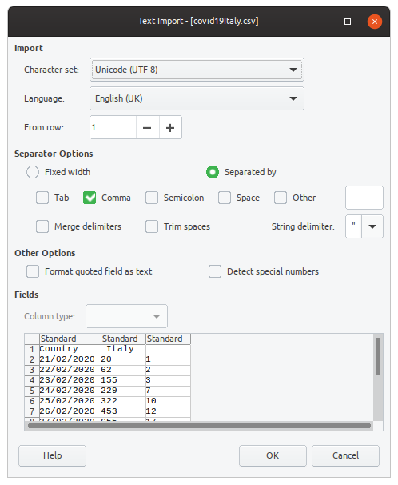
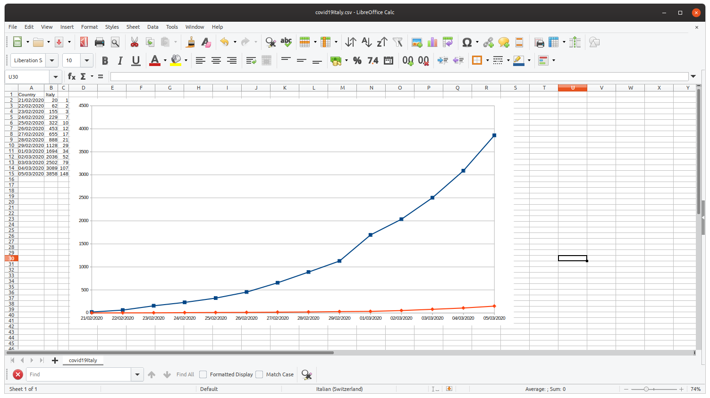

# Covid19 downloader

Since the beginning of the Covid-19 disease, the Johns Hopkins university made available worldwide this [site](https://gisanddata.maps.arcgis.com/apps/opsdashboard/index.html#/bda7594740fd40299423467b48e9ecf6) representing in real time the evoluzion of the infectuous disease as a worldwide map where red circles centered on each country represent the updated situazion in terms of confirmed infected.

This picture, though, gives only a snapshot of the current situation but there is this [GitHub](https://github.com/CSSEGISandData/COVID-19) site, updated every day, containing the history of these databases day by day in CSV (Comma Separated Values) format.

This repository contains a simple bash script that downloads these files, filters out the desired country and generates a CSV file with the time series of infected and deaths for the selected country.

It should run on most linux distributions and it needs only

* curl
* libreoffice

to be installed.

The script is the following 

```
theCountry=$1
echo "Country, $theCountry" > covid19$theCountry.csv
for dt in $(seq -w 1 60)
do
    theDay=$(date -d "2020-02-20 +$dt days" +%m-%d-%Y)
    echo $theDay    

    curl "https://raw.githubusercontent.com/CSSEGISandData/COVID-19/master/csse_covid_19_data/csse_covid_19_daily_reports/$theDay.csv" 2>/dev/null | awk -v pat="$theCountry" -F"," '$0~pat{printf ("%s/%s/%s,%s,%s\n", substr($3,9,2), substr($3,6,2), substr($3,1,4),$4,$5) }' >> covid19$theCountry.csv

 done

libreoffice --calc -o covid19$theCountry.csv
```

# Usage

You should have the admin rights for the machine or you should be a sudoer.

1. Download the script from [here](https://raw.githubusercontent.com/fjovine/Covid19/master/get.sh) saving it in a folder for which write rights are provided

2. Make the script executable with the command
chmod 0777 get.sh

3. Run the script with `./get.sh <country>.`

For Italy open a command window and type `./get.sh Italy`.

After a while during which you will see the dates being downloaded and filtered, **libreoffice** is launched and the generated data will be processed.

A dialog like this will be shown



Pressing the **OK** button you will get a spreadsheet with three columns, containing

* the date
* the infected count
* the dead count

After manually creating the chart, you will get something like the following



# Limitations
The script loads up to 60 days starting from February 20th 2020.
